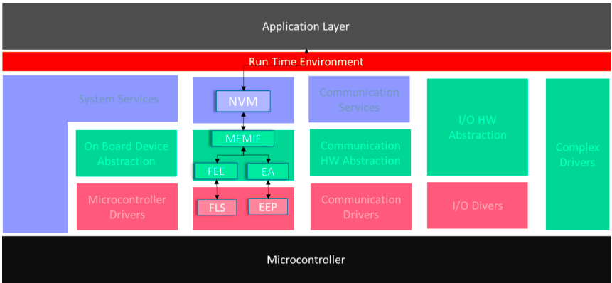
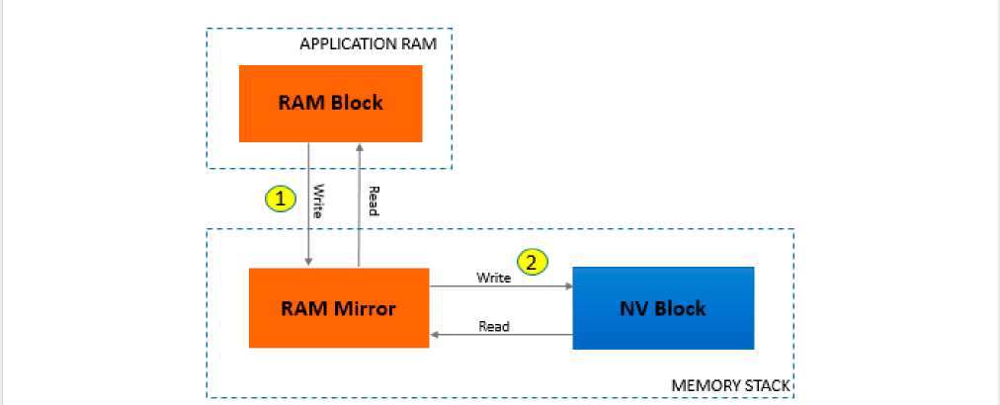

### Basic storage objects

A “Basic Storage Object” is the **smallest entity** of a “NVRAM block”. Several “Basic Objects” can be used to build a NVRAM Block. A “Basic Storage Object” can reside in **different memory locations** (RAM/ROM/NV memory).

#### RAM Block

The “RAM Block” is a “Basic Storage Object”. It represents the part of a “NVRAM Block” which resides i**n the RAM**.

由什么组成呢？
user data，CRC value (optionally)， NV block header(optionally)

RAM block 对于NVRAM Block是可选的
#### ROM Block

The “ROM Block” is a “Basic Storage Object”. It represents the part of a “NVRAM
Block” which resides in the ROM. The “ROM Block” is **an optional part** of a “NVRAM
Block”

ROM block 对于NVRAM Block是可选的
#### NV Block
The “NV Block” is a “Basic Storage Object”. It represents the part of a “NVRAM
Block” which resides in the **NV memory.** The “NV Block” is **a mandatory part** of a
“NVRAM Block”

NV Block 对于NVRAM Block是强制要求的

#### Administrative Block

The “Administrative Block” is a “Basic Storage Object”. It resides **in RAM**. The “Administrative Block” is **a mandatory par**t of a “NVRAM Block”.
Contents of Administrative Block are of non-persistent nature and resides **in the RAM**.

It is used to hold attribute/error/status information of the corresponding NVRAM blocks well as the block indices specifically for NVRAM blocks of type 'Dataset’. This is **a mandatory part** of NVRAM block.
它用于保存相应 NVRAM 块的属性/错误/状态信息，以及专门用于 'Dataset' 类型 NVRAM 块的块索引。这是 NVRAM 块的**必需部分**。
### Block Management types

#### Native NVRAM block

The Native NVRAM block is the simplest block management type. It allows storage to/retrieval from NV memory with a minimal overhead.

NVM_BLOCK_NATIVE type of NVRAM storage consists of the following basic storage objects:

NV Blocks: 1
RAM Blocks: 1
ROM Blocks: 0..1
Administrative Blocks:1

### Redundant NVRAM block
In addition to the Native NVRAM block, the Redundant NVRAM block provides enhanced fault tolerance, reliability and availability. It increases resistance against data corruption. **The Redundant NVRAM block consists of two NV blocks, a RAM block and an Administrative block**.
In case NV Block associated with a Redundant NVRAM block is deemed invalid (e.g. during read), an attempt is made **to recover** the NV Block using data from the incorrupt NV Block.

NVM_BLOCK_REDUNDANT type of NVRAM storage consists of the following basic storage objects:
NV Blocks: 2
RAM Blocks: 1
ROM Blocks: 0..1
Administrative Blocks:1

### Dataset NVRAM block
The Dataset NVRAM block is an array of equally sized data blocks. The application can at one-time access exactly one of this data block.

NVM_BLOCK_DATASET type of NVRAM storage consists of the following basic
storage objects:
NV Blocks: 1..NvMNvBlockNum
RAM Blocks: 1
ROM Blocks: 0..NvMRomBlockNum
Administrative Blocks: 1

The total number of configured datasets (NV+ROM blocks) must be in the range of 1..255.
A specific dataset element is accessed by setting the corresponding index using the API NvM_SetDataIndex. Elements with an index from 0 up to NvMNvBlockNum - 1 represent the NV Blocks, while the ones with an index from NvMNvBlockNum up to NvMNvBlockNum +NvMRomBlockNum - 1 represent the ROM blocks. The NVRAM Block user has to ensure that a valid dataset index is selected before accessing data
elements.

### Synchronization Mechanism supported

Two types of synchronization mechanisms are supported while accessing data to and from NvM module’s RAM mirror.
在访问NvM模块的RAM镜像时，支持两种类型的同步机制。

### Implicit synchronization

In the Implicit synchronization, Application and NvM have concurrent access to a common RAM Block. Application writes/reads the data to/from RAM by invoking NvM API’s.
在隐式同步中，应用程序和 NvM 可以同时（并发）访问公共 RAM 块。应用程序通过调用 NvM API 向 RAM 写入/读取数据。

In this case, RAM Block is mapped to one SW-C and sharing of RAM block is not recommendable. Whenever SW-C accesses NVRAM using RAM block (temporary /permanent), it has to ensure the data consistency of the RAM block until ongoing operation is completed by the NvM.
在这种情况下，RAM 块被映射到一个 SW-C，不建议共享 RAM 块。每当 SW-C 使用 RAM 块访问 NVRAM（临时/永久）时，必须确保 RAM 块的数据一致性，直到 NvM 完成正在进行的操作。

Following steps need to be considered while using Implicit synchronization.

 Write request:
1. The application fills a RAM block with the data that has to be written by the NvM module
2. The application issues the NvM_WriteBlock or NvM_WritePRAMBlock request which transfers control to the NvM module.
3. From now on the application must not modify the RAM block until success or failure of the request is signaled or derived via polling. In the meantime, the contents of the RAM block may be read.
4. An application can use polling to get the status of the request or can be informed via a callback function asynchronously.
5. After completion of the NvM module operation, the RAM block is reusable for modifications.

应用程序将需要由 NvM 模块写入的数据填充到 RAM 块中。  

应用程序发出 NvM_WriteBlock 或 NvM_WritePRAMBlock 请求，该请求将控制权转移到 NvM 模块。  

从此时起，应用程序不得修改 RAM 块，直到请求的成功或失败通过信号或轮询得出。在此期间，可以读取 RAM 块的内容。 

应用程序可以使用轮询获取请求状态，也可以通过回调函数异步接收通知。

在 NvM 模块操作完成后，RAM 块可以重新使用并进行修改。

 Multi block write request (NvM_WriteAll):
1. The ECU state manager issues the NvM_WriteAll request which transfers control to the NvM module.
2. The ECU state manager can use polling to get the status of the request or can be informed via a callback function.

ECU状态管理器发出NvM_WriteAll请求，该请求将控制权转移给NvM模块。  

ECU状态管理器可以通过轮询来获取请求的状态，也可以通过回调函数接收通知。

### Explicit synchronization

In Explicit synchronization, NvM defines a RAM mirror which is used to exchange data with the RAM block of Application. Application writes the data in RAM block and invokes NvM write API. NvM invokes API to read the RAM mirror and data is copied from RAM mirror to RAM block and finally to NV block. The data is transferred by the application in both directions via callback routines, called by the NvM module.
在显式同步中，NvM 定义了一个 RAM 镜像，用于与应用程序的 RAM 块交换数据。应用程序将数据写入 RAM 块并调用 NvM 写入 API。NvM 调用 API 读取 RAM 镜像，数据从 RAM 镜像复制到 RAM 块，最后复制到 NV 块。数据由应用程序通过 NvM 模块调用的回调例程在两个方向上传输。

The advantage is that applications can control their RAM block in an efficient way.
They are responsible for copying consistent data to and from the NvM module’s RAM mirror using ReadRamBlockFromNvM / WriteRamBlockToNvM. Application has to ensure data integrity of RAM block while copying data to/from RAM mirror.

The drawbacks are the additional RAM that needs to have the same size as the largest NVRAM block that uses this mechanism and the necessity of an additional copy between two RAM locations for every operation.
其缺点是需要额外的 RAM，其大小必须与使用此机制的最大 NVRAM 块相同，并且每次操作都必须在两个 RAM 位置之间进行额外的复制。

This mechanism especially enables the sharing of NVRAM blocks by different applications, if there is a module (e.g.NvBlockSwComponentType) that synchronizes these applications and is the owner of the NVRAM block from the NvM module’s perspective.
这种机制特别使不同应用程序能够共享 NVRAM 块，如果存在一个模块（例如 NvBlockSwComponentType）可以同步这些应用程序，并且从 NvM 模块的角度来看，它是 NVRAM 块的所有者。

Following steps need to considered while using Explicit synchronization

 Write request:
1. The application fills a RAM block with the data that has to be written by the
NvM module.
2. The application issues the NvM_WriteBlock or NvM_WritePRAMBlock
request.
3. The application might modify the RAM block until the routine
NvMWriteRamBlockToNvM is called by the NvM module.
4. If the routine NvMWriteRamBlockToNvM is called by the NvM module, then the application has to provide a consistent copy of the RAM block to the destination requested by the NvM module. The application can use the return value E_NOT_OK in order to signal that data was not consistent. The NvM module will accept this NvMRepeatMirrorOperations times and then postpones the request and continues with its next request.
5. Continuation only if data was copied to the NvM module:
6. From now on the application can read and write the RAM block again.
7. An application can use polling to get the status of the request or can be informed via a callback routine asynchronously.

 写入请求：  
1. 应用程序将需要由 NvM 模块写入的数据填充到 RAM 块中。  
2. 应用程序发出 NvM_WriteBlock 或 NvM_WritePRAMBlock 请求。  
3. 在 NvM 模块调用 NvMWriteRamBlockToNvM 例程之前，应用程序可能会修改 RAM 块。  
4. 如果 NvM 模块调用了 NvMWriteRamBlockToNvM 例程，则应用程序必须向 NvM 模块请求的目标提供 RAM 块的一致副本。应用程序可以使用返回值 E_NOT_OK 来表示数据不一致。NvM 模块会接受此返回值 NvMRepeatMirrorOperations 次，然后推迟该请求并继续处理下一个请求。  
5. 仅当数据已复制到 NvM 模块时才继续：  
6. 从现在起，应用程序可以再次读写 RAM 块。
7. 应用程序可以使用轮询来获取请求的状态，或者可以通过回调例程以异步方式被通知。

Multi block write request (NvM_WriteAll):
1. The ECU state manager issues the NvM_WriteAll request which transfers control to the NvM module.
2. During NvM_WriteAll job, if a synchronization callback (NvM_WriteRamBlockToNvM) is configured for a block it will be called by the NvM module. In this callback the application has to provide a consistent copy of the RAM block to the destination requested by the NvM module. The application can use the return value E_NOT_OK in order to signal that data was not consistent. The NvM module will accept this NvMRepeatMirrorOperations times and then report the write operation as failed.
3. Now the application can read and write the RAM block again.
4. The ECU state manager can use polling to get the status of the request or can be informed via a callback function.

多块写入请求（NvM_WriteAll）：  
1. ECU 状态管理器发出 NvM_WriteAll 请求，该请求将控制权转移到 NvM 模块。  
2. 在 NvM_WriteAll 作业期间，如果某个块配置了同步回调（NvM_WriteRamBlockToNvM），NvM 模块将调用该回调。在此回调中，应用程序必须向 NvM 模块请求的目标提供 RAM 块的一致副本。应用程序可以使用返回值 E_NOT_OK 来表示数据不一致。NvM 模块将接受该操作 NvMRepeatMirrorOperations 次，然后报告写入操作失败。  
3. 现在应用程序可以再次读取和写入 RAM 块。  
4. ECU 状态管理器可以通过轮询方式获取请求状态，也可以通过回调函数获得通知。

### Other features

#### CRC based comparison

The NvM module internally uses CRC generation routines (8/16/32 bit) to check and to generate CRC for NVRAM blocks as a configurable option.
The NvM module provides an option to skip writing of unchanged data by
implementing a CRC based compare mechanism. CRC based compare mechanism can be enabled by setting configuration parameter
NvMBlockUseCRCCompMechanism.

Note - In general, there is a risk that some changed content of an RAM Block leads to the same CRC as the initial content so that an update might be lost if this option is used. Therefore, this option should be used only for blocks where this risk can be tolerated.

NvM 模块内部使用 CRC 生成例程（8/16/32 位）来检查和生成 NVRAM 块的 CRC，作为可配置选项。NvM 模块提供了通过实现基于 CRC 的比较机制来跳过写入未更改数据的选项。可以通过设置配置参数NvMBlockUseCRCCompMechanism 来启用基于 CRC 的比较机制。

注意 - 一般来说，如果 RAM 块的一些内容发生了变化，但生成的 CRC 与初始内容相同，则使用该选项可能导致更新丢失。因此，该选项应仅在可以容忍此风险的块中使用。

### Error recovery
The NvM module provides implicit error recovery on read for NVRAM block
management types NATIVE and REDUNDANT by loading default values (if configured via either the parameter NvMRomBlockDataAddress or the parameter NvMInitBlockCallback).
NvM 模块通过加载默认值（如果通过参数 NvMRomBlockDataAddress 或者参数 NvMInitBlockCallback 配置）为 NVRAM 块管理类型 NATIVE 和 REDUNDANT 提供了读取时的隐式错误恢复。

The explicit retrieval of ROM data is available for all block management types by calling the API NvM_RestoreBlockDefaults. For DATASET, the related index must be set (pointing at a ROM block) prior to calling this API.
通过调用 API NvM_RestoreBlockDefaults，可以对所有块管理类型显式地检索 ROM 数据。对于 DATASET，必须在调用此 API 之前设置相关的索引（指向一个 ROM 块）。

The NvM module provides error recovery on read for NVRAM blocks of block management type NVM_BLOCK_REDUNDANT by loading the RAM block with default values.
The NvM module provides error recovery on write by performing write retries regardless of the NVRAM block management type.
NvM 模块通过将 RAM 块加载为默认值，为 NVM_BLOCK_REDUNDANT 类型的 NVRAM 块在读取时提供错误恢复。 NvM 模块通过执行写入重试，为所有 NVRAM 块管理类型提供写入时的错误恢复。

# AUTOSAR 非易失性存储数据处理指南总结

## 📚 文档概述
- 本文档针对AUTOSAR Classic Platform 4.4.0版本，详细介绍了非易失性存储器（NVRAM）数据的管理与访问方式。  
- 通过NVRAM管理器（NvM）模块，提供对非易失性数据的同步与异步访问服务，确保数据在断电后依然持久保存。  
- 文档涵盖基本存储对象定义、块管理类型、同步机制、错误恢复、写验证等核心机制。  
- 提供了多种软件组件（SW-C）访问NVRAM的应用场景，包括通过ServiceSwComponent和NvBlockSwComponent两种方式。  
- 详细描述了RAM块初始化、数据同步策略及不同同步模式（隐式与显式同步）的优劣。  

## ⚙️ 核心机制与概念
- **基本存储对象**：包括RAM块、ROM块、NV块和管理块，构成NVRAM块的不同组成部分。  
- **块管理类型**：支持原生块、冗余块和数据集块，满足不同故障容错与数据访问需求。  
- **同步机制**：  
  - 隐式同步：应用直接访问共享RAM块，需保证数据一致性。  
  - 显式同步：通过NvM定义的RAM镜像和回调函数实现数据拷贝，提高共享灵活性，但增加内存开销。  
- **错误恢复与写验证**：通过CRC校验和冗余存储机制保障数据完整性。  
- **RAM块状态管理**：通过API维护RAM块的变更状态，优化写入次数，延长存储器寿命。  
- **软件版本兼容性**：允许通过配置参数处理软件变更导致的NVRAM数据初始化策略。  

## 🛠️ 软件组件访问与使用案例
- **ServiceSwComponent方式**：应用作为客户端，通过客户端-服务器接口调用NvM服务，支持隐式与显式同步。  
- **NvBlockSwComponent方式**：RTE分配RAM块，支持多软件组件共享，利用NV数据接口进行部分或全部数据访问。  
- **主要用例分类**：  
  1. 无永久RAM块，应用管理RAM（隐式/显式同步）。  
  2. 有永久RAM块，由RTE分配（隐式同步）。  
  3. 使用NvBlockSwComponent类型，支持共享RAM块和复杂映射（显式同步）。  
- **写入策略**：支持无dirtyFlag、周期写入、关机写入和立即写入多种模式，由RTE管理触发写操作。  

## 🗂️ 配置与接口设计
- 利用ARXML配置文件定义接口、内存分配、同步机制和写入策略。  
- 利用Client-Server接口进行命令调用与状态通知。  
- 通过NvData接口实现非易失性数据的变量级映射和访问，实现模块化与复用。  

## ⚡ 关键优势与注意事项
- 显式同步机制支持多应用共享NVRAM块，提高资源利用率。  
- CRC比较机制减少不必要的写操作，但存在哈希冲突风险。  
- 软件版本变更需要谨慎配置，防止数据错误加载。  
- 应用层需负责数据一致性，特别是隐式同步和永久RAM块的场景。  

---

# AUTOSAR 非易失性存储数据处理指南结构化思维导图

## 📦 1. 文档介绍与背景
- AUTOSAR CP 4.4.0版本文档  
- 非易失性存储数据管理指南  
- 适用汽车应用，版权与免责声明  

## 🧱 2. 基本概念与存储对象
### 2.1 基本存储对象
- RAM块：存储运行时数据，可选CRC  
- ROM块：只读默认数据，防止损坏时恢复  
- NV块：持久存储区，必选，含CRC和头部信息  
- 管理块：RAM中非持久信息，管理状态与错误  
### 2.2 块管理类型
- 原生NVRAM块：单NV块，简单管理  
- 冗余NVRAM块：双NV块，增强容错  
- 数据集NVRAM块：多个数据集，单次访问一个  

## ⚙️ 3. NvM同步机制
### 3.1 隐式同步
- 应用直接读写共享RAM块  
- 需应用保证数据一致性  
- 典型写流程与状态通知  
### 3.2 显式同步
- NvM提供RAM镜像，应用通过回调同步数据  
- 支持多应用共享NVRAM块  
- 额外内存开销与复制负担  
- 写请求流程与错误重试机制  

## 🔧 4. 其他关键特性
### 4.1 CRC比较与错误恢复
- 可选CRC比较减少写操作  
- 读取失败自动加载默认值  
- 写入失败支持重试与错误报告  
### 4.2 RAM块状态管理
- NvM_SetRamBlockStatus用于标记数据变更  
- 启动时基于CRC判断是否覆盖RAM数据  
- 关机时优化写入，减少Flash磨损  
### 4.3 软件版本兼容性
- 配置参数控制是否响应配置变更  
- 维护配置ID，防止错误数据加载  
- 对配置参数变更有限制  

## 🧩 5. 软件组件访问方式及用例
### 5.1 ServiceSwComponent访问
- 客户端-服务器接口调用NvM服务  
- 用例1a：无永久RAM，隐式同步  
- 用例1b：无永久RAM，显式同步  
### 5.2 有永久RAM的访问（用例2）
- RAM由RTE分配，隐式同步  
- 访问通过Rte_Pim API  
- 单一应用独占RAM块  
### 5.3 NvBlockSwComponent访问（用例3）
- RAM块由RTE分配，支持多SW-C共享  
- NV数据接口支持部分映射  
- 同步机制为显式同步  
- 支持脏标志写入策略（周期、关机、立即）  
- 显式与隐式通信方式的差异  

## 🔄 6. RAM块初始化与恢复
- 使用NvM_ReadAll批量初始化RAM块  
- 支持单个块显式初始化  
- 启动时基于数据有效性决定覆盖策略  
- 结合模式管理启动流程  

## 📁 7. 配置与接口设计
- ARXML配置文件管理接口和内存映射  
- Client-Server和NvData接口详细定义  
- 映射关系通过RteNvRamAllocation实现  
- 支持多种写入策略及同步机制配置  

---