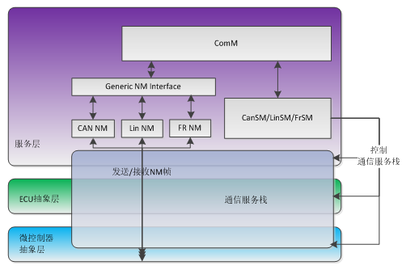

The ComM module shall propagate a call of **ComM_GetCurrentComMode()** (see SWS_ComM_00083) to the Bus State Manager module(s) for the channel(s) the user are configured to (see also SWS_ComM_00176 and SWS_ComM_00798)⌋

Rationale for SWS_ComM_00084: State requests have to be propagated to the corresponding Bus State Manager module **since the ComM module does not control the actual bus state**.

每一个PNC 都有自己的状态机， PNC状态机和ComM状态机之间有一些简单的mapping关系

标准原文：
Each PNC has its own state. The state definitions are related to the states of ComM for a simple mapping.

重点！！！
Each PNC uses a dedicated bit position within a bit vector in the NM user data on CAN and FlexRay. If a PNC is requested by a local ComM user on the node, the node sets the corresponding bit in the NM user data to 1. If the PNC is not requested anymore; the node sets the corresponding bit in the NM user data to 0. The BusNms collect and aggregate the NM user data for the PNCs and provide the status via a COM bit vector by means of a COM signal to ComM.

Each PNC uses the same bit position in the NM user data on every system channel with NM. ComM uses two types of bit vector named EIRA and ERA to exchange PNC status information. The definition of “EIRA” and “ERA” are located in the AUTOSAR SWS CAN NM and AUTOSAR SWS FlexRay NM.

Partial networking shall be supported on the bus types CAN, FlexRay. Activation and deactivation of the I-PDU groups of the PNCs on a FlexRay node is required to avoid false timeouts. Starting and Stopping of I-PDU groups in COM are handled in BSWM.

**ERA/EIRA**
ComM expects that the PNC bit vector is configured as an array of type uint8_n, see config parameter ComMPncComSignalRef

ComM 会收集每个通道上EIRA 和 ERA的信息最终集合在一个 EIRA和ERA中
ComM aggregates the EIRA / ERA vectors from different bus systems resulting in one EIRA generally and one ERA per ComM channel

ERA 用于带转发的系统上。

