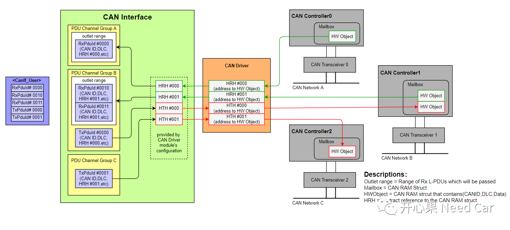
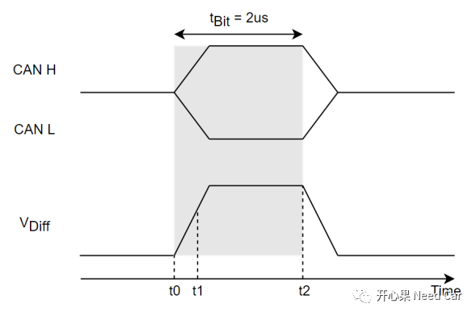
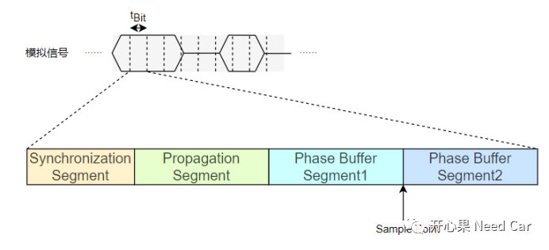
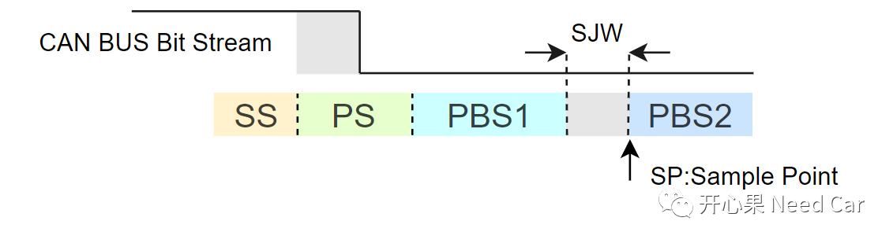
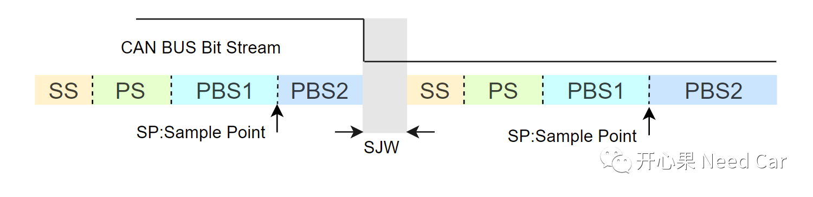
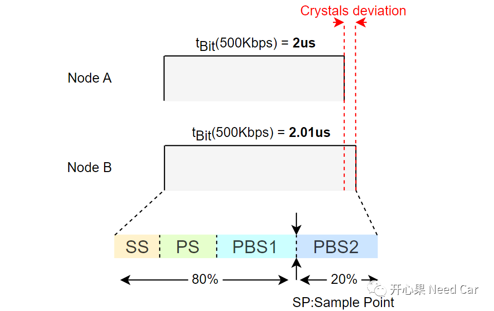
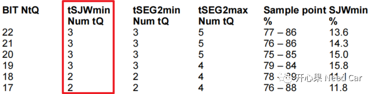
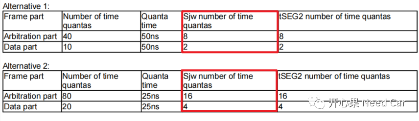
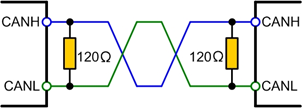

# CAN

### 名词解释
**Mailbox**: 邮箱，就是can驱动所具有的接收缓存区和发送缓冲区，接收缓冲区和发送缓冲区均在RAM区。

**HWObject**：硬件对象，包含CAN ID，DLC，Data，等信息的RAM区

**HRH**：Hardware Receive Handle，接收句柄，一个HRH表示一个接收HWObject。

**HTH**：Hardware Transmit Handle，发送句柄，一个HTH表示一个发送HWObject。

Mailbox、HWObject、HRH、HTH、Controller、Transceiver之间的关系如下所示：

### 采样点

CAN通信高低电平是怎么判断的？
CAN是双绞线 CAN_H和CAN_L，通过CAN_H和CAN_L电压差来判断高低电平的

##### 什么是采样点？
比如发送方与接收方使用相同的通信速率，则每一个Bit传输的时间固定，比如500kbps，则传输一个bit用时2us（Tbit），在Tbit 的某个点去采样，以此点采集的值CAN_H和CAN_L的电压差转换为数字信号1或者0，这个**采集信号值的点**就是采样点。
如下图所示：

##### 为什么需要采样点？

既然传输一个Bit用时是固定的，可以在tBit任意时间内采集信号值吗？
**答**：不可以。

**设计采样点的主要目的是确保采样值的可靠性**

CAN H或者CAN L引脚的拉高、拉低取决于对应电容充/放电速度，因此，CAN H或者CAN L的电压改变时，有一个斜率，如下所示：

假设t0~t2是一个tBit时间，如果在t0~t1时刻采样，可能会因为CAN H和CAN L上的电压不稳定，VDiff没有达到阈值，导致采样值错误。因此，需要选择CAN H和CAN L电压稳定的阶段采样，以此确保采集的值与实际发送值匹配。

为了精确采样，11898规范中将一个Bit划分成4个段：
同步段（_**SS:Synchronization Segment**_）
传播段（_**PS:Propagation Segment**_）
相位缓冲段1（**_PBS1:Phase Buffer Segment1_**）
相位缓冲段2（**_PBS2:Phase Buffer Segment2_**）
如下所示：

规范要求**采样点在相位缓冲段1和相位缓冲段2之间**。
同步段：同步CAN总线上连接的节点；
传播段：吸收信号在物理线路上的延时。信号从发送端到接收端，Transceiver和双绞线会产生一定的延时；
相位缓冲段1，相位缓冲段2：补偿CAN总线上连接节点的晶振偏差；

工程中通常会要求75%或者80%采样点。实际上就是约定一个采样时刻，确保网段内所有CAN节点在近乎相等的时刻采样。

SOF start of frame 帧启示位

SJW是什么？
SJW Synchronization Jump Width
SJW扮演着什么样的角色？
重同步的门限值。
想要了解SJW 需要先了解CAN通信中的同步机制。CAN的同步机制分为硬同步和重同步。

**硬同步**：
在SOF为止，总线上所有节点准备竞争总线的使用权，即所有节点都检测到了起始的显性位（“0”），总线上所有节点可以公平竞争，这就是硬同步。

**重同步：**
Backgroud：一帧报文 由很多个bit位构成，硬同步使得节点在帧起始位置完成时序的对齐，但是，随着一个一个bit在CAN总线上的串行传输，每个bit的宽度稳定性（时序无法对齐）无法保证，此时就需要重同步来确保bit的传输时序。
那什么是重同步呢？
当CAN总线上出现相位差时，通过延长PBS1或者PBS2来弥补采样误差，这就是重同步。
具体方式：
- 若下降沿滞后（位于SS之后、采样点之前），则延长PBS1（延长量≤SJW）。
- 若下降沿提前（位于采样点之后、SS之前），则缩短PBS2（缩短量≤SJW）。

1.PBS1延长SJW实现重同步
当总线上的Bit流由隐性位（"1"）变为显性位（"0"）时，如果下降沿落在了SS之后，采样点之前，接收节点会延长PBS1长度，以此弥补发送节点滞后导致的偏差。PBS1延长的宽度小于等于SJW，最大延长宽度为SJW，如下所示：

2.PBS2缩短SJW实现重同步
当总线上的Bit流由隐性位（"1"）变为显性位（"0"）时，如果下降沿落在了采样点之后，SS之前，接收节点会缩短PBS2长度，以此弥补发送节点提前导致的偏差。PBS2缩短的宽度小于等于SJW，最大延长宽度为SJW，如下所示：

为什么会有相位差呢？或者说，为什么总线上的下降沿会提前或者滞后呢？
**答**：总线上的节点，虽然处于同一个局域网内，但是，每个节点的晶振精度未必相同，节点晶振之间可能存在偏差，因此，晶振主导的时钟频率就可能存在相位差，即：不同的节点，**虽然设置了相同的通信速率，也可能存在tBit长度不同的可能**，因此，**发送节点在发送Bit流的时候**，**接收节点可能识别到下降沿的滞后或者提前**。此时，就需要重同步弥补此偏差。

晶振偏差导致的相位差，如下所示：

PBS1延长多少，PBS2缩短多少，由SJW值决定。eg：SJW = 3，则PBS1可以延长3个Tq，或者PBS2缩短3个Tq。

所以，**SJW不参与采样点的计算，它只是重同步时，延长PBS1或者缩短PBS2长度的最大值**。

那么SJW应该怎么配置呢？或者说配置的标准是什么呢？
工程开发中，CAN总线的需求中，一般都会明确**SJW（Synchronization Jump Width）**的约束，比如：

Classic CAN的SJW需求

CAN FD的SJW需求

**AI回答**：
核心配置标准：由最大晶振偏差决定
SJW配置的根本标准是必须能够补偿整个CAN网络中所有节点之间可能存在的最大时钟频率偏差。
相位差产生的根源是“每个节点的晶振精度未必相同”。因此，SJW的配置不是一个随意值，而是基于对网络中最差情况下时钟精度偏差的计算。

CAN总线节点的**竞争机制**是CAN协议的核心特性之一——**非破坏性逐位仲裁**
什么是非破坏性逐位仲裁？
简单来说，它是一种“优雅的竞争”机制，能确保在多个节点同时想发言时，**优先级最高的那个可以毫无障碍地胜出，并且整个过程不会浪费任何时间或破坏正在传输的数据**。

为了让你快速抓住核心，这个机制的运作可以概括为以下几个关键点：

| 核心要素              | 具体说明                                                                                             | 类比与效果                                       |
| ----------------- | ------------------------------------------------------------------------------------------------ | ------------------------------------------- |
| **⚡ 仲裁依据**​       | 报文标识符（ID），**ID值越小，优先级越高**。标识符的每一位（bit）本身是二进制数，**显性位（逻辑0）优先级高于隐性位（逻辑1）**。                         | 就像拥有VIP通行证，号码越靠前（ID越小），权力越大。                |
| **🔌 物理基础：线与特性**​ | 总线具有“线与”特性：只要有一个节点发送显性位（0），总线状态就是显性（0）；**只有当所有节点都发送隐性位（1）时，总线才是隐性（1）**。                          | 如同多人表决“是否通过”，只要有一人反对（显性位0），结果就是“不通过”（总线为0）。 |
| **👀 实现方式：回读机制**​ | 每个节点在发送每一位的同时，会**实时回读总线上的实际电平**。如果发现自己发送的是隐性位（1）但读回的是显性位（0），它就明白有更高优先级的节点存在，于是**立即停止发送，转为接收状态**。 | 就像一边说话一边听，一旦发现有人插话且优先级更高，就马上礼貌地停下来听对方说。     |
| **🎯 仲裁过程**​      | 从标识符的最高位（MSB）开始逐位比较。节点在某个位发送隐性位（1）却读到显性位（0）时退出仲裁。**最终，标识符数值最小的节点胜出**，并继续完成整个报文的发送，过程没有任何延迟。      | 一场从高位到低位逐位比较、输家主动退出的淘汰赛，胜者完整发言。             |

### CAN总线为什么需要120欧姆的终端电阻？

参考链接：
https://mp.weixin.qq.com/s/_GpJRKYy-Kj5hfn-5GjBLw

### 波特率

### Full CAN和Basic CAN是什么？

Basic CAN：一个HWObject 可以处理一段范围内的CAN ID
Full CAN：一个HW Object只能处理单个CAN ID

Autosar对FullCAN和BasicCAN的解释如下所示：

### Full CAN 和 Basic CAN的区别
 
不管是Basic CAN还是Full CAN，均需要消耗硬件资源HOH，HOH也就是常说的**邮箱**（mailbox），进一步细化HOH，又分为HRH（CAN hardware receive handle）和HTH（CAN hardware transmit handle）。

**Full CAN**：一个HOH只能接收或者发送一个CAN报文（或者说一个L-PDU），HOH可以配置成HTH或者HRH。  

**Basic CAN**：一个HOH接收或者发送多个CAN 报文（或者说多个L-PDU），HOH可以配置成HTH或者HRH。

### 不同报文如何选择Basic CAN 和Full CAN

**应用报文**：一般选择配置成FULL CAN类型，对于应用报文，一般不需要缓存，使用最新接收的数据即可。对于发送的应用报文，都配置成FULL CAN类型需要一个前提：上层需要发送应用报文数量＜底层硬件缓存区数量。比如：底层发送硬件缓存区数量为32，节点需要发送的应用报文数量为50，显然无法将50个发送的应用报文都配置成FULL CAN。遇到这种情况，一般会将重要的应用报文配置成FULL CAN，而其他要发送的应用报文配置成BASIC CAN

**诊断报文**：一般选择配置成BASIC CAN类型（结合FIFO Buffer使用），因为诊断报文的请求/响应不能错序，需按照顺序处理，且数据不能覆盖；

**网络管理报文**：接收一般选择配置成BASIC CAN类型，因为一个节点一般会要求接收一段范围的网络管理报文，eg:0x500~0x53F。发送网络管理报文配置成FULL/BASIC CAN类型均可，如果资源够用，推荐配置成FULL CAN类型，因为每个节点的发送网络管理报文唯一；

**标定报文**：一般选择配置成FULL CAN类型。

### Basic CAN 如何配置filter mask 和code mask

以报文0x305为例，需要接收的报文还有0x307,0x302。
CAN ID 为11位
报文0x305，0x307,0x302
高8位是一样的，低3位分别是101b,111b,010b
故最低三个bit不**能作为过滤的bit**，所以在MCAL这边需要配置的Can Hw Filter Code为**0x305**,Can Hw Filter Mask为**0x7f8**，这样配置完后，在**CAN Driver**这边能接收的报文可以从**0x300-0x307**

**CAN ID & 过滤掩码 (Mask) == 过滤码 (Code) & 过滤掩码 (Mask)**​
- **掩码 (Mask)**：像一个“关注度模板”，它用二进制位来定义哪些位需要严格检查。**`1`表示“关心”此位，必须精确匹配；`0`表示“不关心”此位，可以是任意值**。
    
- **过滤码 (Code)**：它定义了所有被“关心”的位应该匹配的具体值。

简单来说，**将Code设置为`0x305`，Mask设置为`0x7F8`，是为了精准地接收CAN ID从`0x300`到`0x307`这8个报文。**

下面我们通过一个表格来分解这个计算过程，它会非常清晰。

### 🔢 滤波参数计算详解

| 步骤  | 参数                | 数值（16进制）                                                                          | 数值（11位二进制）                                                  | 说明                                                                                                    |
| --- | ----------------- | --------------------------------------------------------------------------------- | ----------------------------------------------------------- | ----------------------------------------------------------------------------------------------------- |
| 1   | **目标ID范围**​       | `0x300`- `0x307`                                                                  | `011 0000 0000`- `011 0000 0111`                            | 我们希望接收的ID范围。                                                                                          |
| 2   | **分析位模式**​        | -                                                                                 | 高8位 (`011 0000 0`) 相同   低3位 (`000`- `111`) 变化            | 识别出哪些位是固定的，哪些位是变化的。                                                                                   |
| 3   | **设置掩码 (Mask)**​  | `0x7F8`                                                                           | `111 1111 1000`                                             | **掩码位为`1`**：对应的ID位必须精确匹配。   **掩码位为`0`**：对应的ID位不关心（可为0或1）。   这里高8位为1，低3位为0，意味着我们只关心ID的高8位，低3位任意。 |
| 4   | **设置过滤码 (Code)**​ | `0x305`                                                                           | `011 0000 0101`                                             | 它定义了所有被“关心”的位（即Mask为1的位）必须匹配的值。我们取这个范围内的**任意一个ID**（如`0x305`）的高8位作为模板。                                 |
| 5   | **计算最小ID**​       | `Code & Mask`   `0x305 & 0x7F8 = 0x300`                                        | `011 0000 0101`&   `111 1111 1000`=   `011 0000 0000` | 计算结果`0x300`就是该过滤器能通过的最小ID。                                                                            |
| 6   | **计算ID数量**​       | `2 ^ (Mask中0的个数)`   `2 ^ 3 = 8`                                                | Mask的低3位是0                                                  | 有3个“不关心”的位，它们可以自由变化，产生2的3次方，即8个不同的ID。                                                                 |
| 7   | **得出范围**​         | `(Code & Mask)`到   `(Code & Mask) + (2^n - 1)`   `0x300`到 `0x300+7 = 0x307` | -                                                           | 最终确定的ID接收范围。                                                                                          |
**核心原理**：滤波器的硬件逻辑是 **`(接收到的CAN ID) & Mask == Code & Mask`**。只要接收到的ID满足这个等式，就能通过过滤器。
基于这个原理，有一个**快速计算范围的方法**：
1. **范围起点**：就是 **`Code & Mask`**。在你这个例子里，`0x305 & 0x7F8 = 0x300`。
2. **范围大小**：由Mask中连续为0的低位个数（n）决定，数量是 **`2^n`**。这里是3个0，所以是8个ID。
3. **范围终点**：就是 **起点 + (2^n - 1)**。这里是 `0x300 + 7 = 0x307`。
所以，无论你选择范围内的哪个ID作为Code（比如选`0x300`，`0x302`，`0x305`都可以），只要Mask是`0x7F8`，最终 `Code & Mask`的结果都是`0x300`，因此过滤出的范围始终是`0x300`到`0x307`。

### ⚖️ 模式对比与应用场景

这种**掩码模式 (Mask Mode)**​ 非常适合接收一组连续的ID，可以**极大地节省硬件滤波器资源。它的对立面是**列表模式 (List Mode)**。
下面的表格清晰地展示了两者的区别和适用场景：

|特性|**掩码模式 (Mask Mode)**​|**列表模式 (List Mode)**​|
|---|---|---|
|**工作原理**​|模糊匹配。定义一位模式（Code）和一个掩码（Mask）来决定哪些位必须匹配，哪些位不关心。|精确匹配。过滤器寄存器本身就是一个或多个需要完全匹配的ID列表。|
|**最佳场景**​|接收一个**连续的ID范围**或具有**相同特征位**的一组ID。|接收少数几个**离散的、不连续**的特定ID。|
|**优点**​|**节省资源**。一个过滤器组可以覆盖多个ID。|**精准**。只会收到明确指定的ID，没有意外。|
|**缺点**​|不够灵活。无法排除该范围内的某个特定ID。|**消耗资源**。每个ID（或每两个ID）需要占用一个过滤器组。|

### J6B can配置
CAN controller全属于MCU域;J6B 数量6
J6B:CAN0~CAN2 为基础CAN，CAN3~CAN5 为增强CAN;

支持硬件时间戳(RTC时间)，每路can 最多128个邮箱（Hardware Object）

一个controller的Ram内划分的Block个数:  
        基础CAN:4 Block(variable payload);  
        增强CAN:4 Block(variable payload)+ 4 Block(固定占用宽度64字节)。  
注:variable payload:当前ram可被划分的最小单位可以是8byte/16byte/32byte/64byte.  
一个controller支持一路RxFIFO，FIFO深度为:  
        基础CAN:8*宽度64 字节;  
        增强CAN :32*宽度64 字节。  
        
每一路CAN仅支持配置1个RxFIFO

EB配置为basic can 接收;不支持TxFIFO。

可变payload：当前ram可被划分的最小单位可以是8byte/16byte/32byte/64byte。

固定payload：当前ram的最小单位只能是64byte，即使实际上一帧长度小于64byte也会占用64byte。

激活ramblock

canfd必须配置canram block；FIFO模式下该配置项不影响其深度。 RamBlock可选择不同的layout（8/16/32/64byte），各个RamBlock可配置的Mailbox个数可根据公式 512/(8+layout) 进行计算，即

1）当Block layout配置为8byte时，可使用的Mailbox个数为32个；

2）当Block layout配置为16byte时，可使用的Mailbox个数为21个；

3）当Block layout配置为32byte时，可使用的Mailbox个数为12个；

4）当Block layout配置为64byte时，可使用的Mailbox个数为7个；

**可使用的所有Block的Mailbox总数不能超过128。**

### 参考

https://mp.weixin.qq.com/s/kQU06sTZ8JuO73nrifZXqA

[^1]: bit
