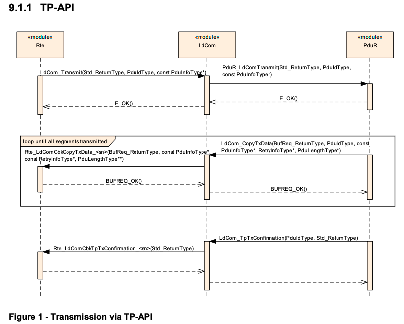
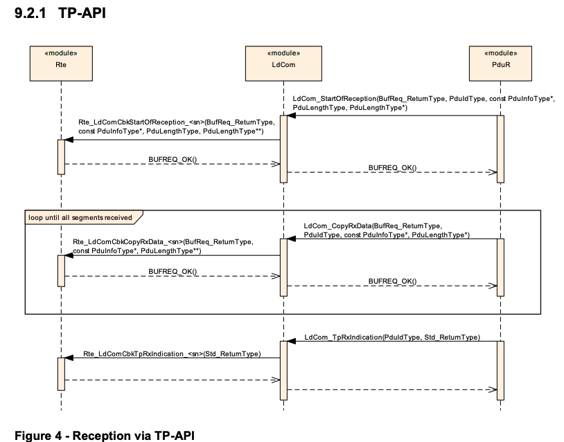
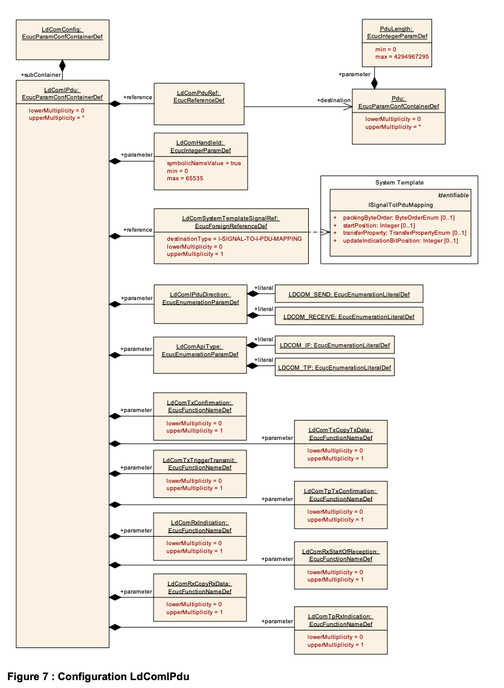

AUTOSAR Large Data Communication模块规范定义了汽车电子系统中高效数据通信的实现框架。该模块作为AUTOSAR分层架构中RTE与PDU Router之间的交互层，专注于非周期性、自发式数据传输场景，通过简化通信流程实现资源高效利用。其核心功能包括：提供面向信号的数据接口、支持大容量动态长度数据传输、兼容IF/TP两种通信模式，并实现PDU导向的数据接口。模块设计严格遵循AUTOSAR标准，支持预编译/链接/后编译三种配置模式，通过ECUC参数实现灵活配置。API设计覆盖传输确认、数据拷贝、接收指示等全流程，特别针对动态长度数据优化了TP模式下的分段传输机制。文档详细规定了初始化/去初始化流程、错误处理机制、依赖模块接口规范，并通过序列图展示了RTE与PDU Router的交互流程。该规范适用于所有汽车域，但要求数据必须满足特定约束条件，如单信号传输、无字节序转换、无过滤/转换等，以确保高效通信实现。

### 名词解释

1. **LdCom**：AUTOSAR基础软件模块，提供高效数据通信机制，专注于非周期性信号传输，通过简化功能实现资源优化。
2. **IF**：接口层通信模式，支持直接传输完整PDU，适用于小数据量场景，提供同步传输确认机制。
3. **TP**：传输协议层通信模式，支持大数据分段传输，通过StartOfReception/CopyRxData/TpRxIndication等API实现流式数据处理。

The AUTOSAR LdCom module uses both sets of PDU Router’s upper layer module APIs. That is the APIs for upper layer modules that use TP and the APIs for upper layer modules that do not use TP. This is necessary since the LdCom module forwards I-PDUs either unfragmented via simple L-PDUs or fragmented via TP.

AUTOSAR LdCom 模块使用 PDU 路由器的两套上层模块 API。即使用 TP 的上层模块的 API 和不使用 TP 的上层模块的 API。这是必要的，因为 LdCom 模块将 I-PDU 通过简单 L-PDU 无分段转发，或者通过 TP 分段转发。

When called by PduR LdCom shall use the passed PDU Id as Handle Id (LdComHandleIdECUC_LdCom_00005), to derive the actualAPI from configuration and use it when passing the call towards RTE.

