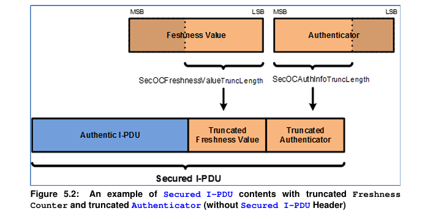

If the authentication build counter has reached the configuration value **SecOCAuthenticationBuildAttempts** the SecOC module shall remove the Authentic I-PDU from its internal buffer and shall drop the received message. 
The VerificationResultType shall be set to **SECOC_AUTHENTICATIONBUILDFAILURE**. 

If **SecOC_VerifyStatusOverride** is used, theverification result and I-PDU are han dled according to overrideStatus value.

If the query of the freshness function returns a non-recoverable error (example: a systematic failure due to **freshness value configuration** ) the SecOC module shall remove the Authentic I-PDU from its internal buffer and shall drop the received message. The VerificationResultType shall be set to **SECOC_FRESHNESSFAILURE**.

The **Freshness Management** shall use **the verification status callout function** to get the result of the verification of a Secured I-PDU. This notification can be used as example to synchronize additional freshness attempts or can be used for counter increments.

The SecOC module shall report each individual verification status (the final one as well as all intermediate ones) according to its current configura tion (see parameter **SecOCVerificationStatusPropagationMode**).
Note: If the Freshness Manager requires the status of a Secured I-PDU if it was verified successfully or not, e.g. to synchronize time or counter, then this status shall be taken from the VerificationStatus service provided by SecOC.