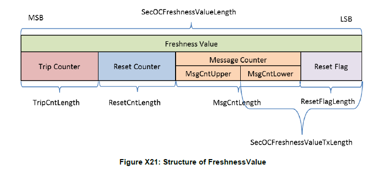
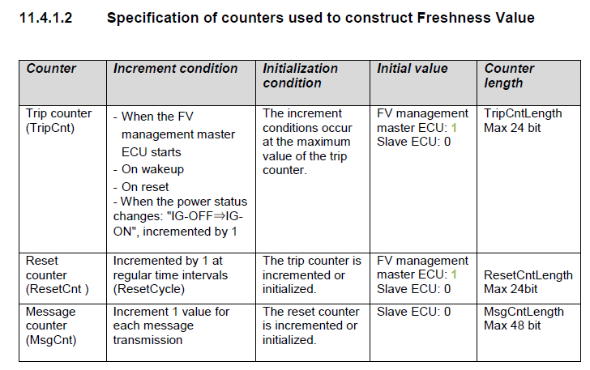

上图讲解：

**Master ECU 主节点**：
通过周期性发送同步报文，给从节点分发TripCnt, RstCnt。
**TripCnt**: 每次上电+1
**RstCnt**: 周期性+1，TripCnt更新时， RstCnt重置
**Slave ECU从节点**：
**TripCnt**: 根据同步报文更新
**RstCnt**: 根据同步报文更新
**MsgCnt Lower**: 每发送一个报文，+1
**MsgCnt Upper**: MsgCnt Lower溢出出时，+1
**Reset Flag**：RstCnt的低2位