很多小伙伴都知道tja1043芯片在总线上有报文的时候INH引脚就会拉高 但是为什么会拉高呢？

在NXP的芯片手册没有明确提的原因，甚至也没有明确提到INH原因

最近在查阅TI的1043 芯片手册，明确提到了 总线上有报文时 INH引脚会拉高。
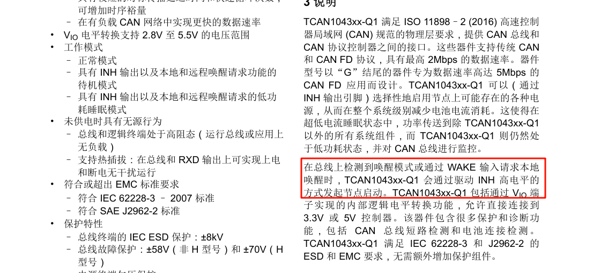

啊？

NXP1043 和 TI 1043 的trac 模式是存在差异的！！！

那么我就针对NXP1043 加电源管理芯片 浅浅的聊一下这样子的休眠唤醒方案吧。

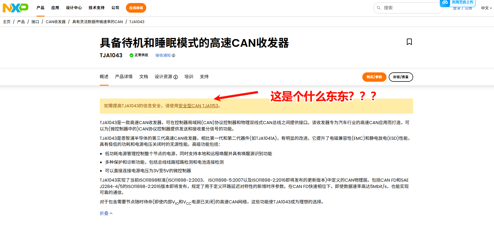

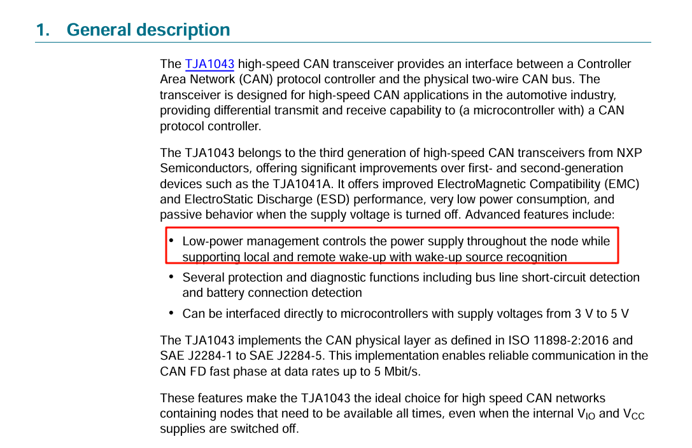
这句话意思我的理解就是在整个节点中 通过低功耗管理节点电源供给，同时支持本地唤醒和远程唤醒 并识别是哪一种唤醒源

怎么通过低功耗管理节点电源管理的呢？
需要电源管理芯片 

又是怎么支持本地唤醒和远程唤醒的呢？
需要着重关注ERR RXD STD EN 四个引脚

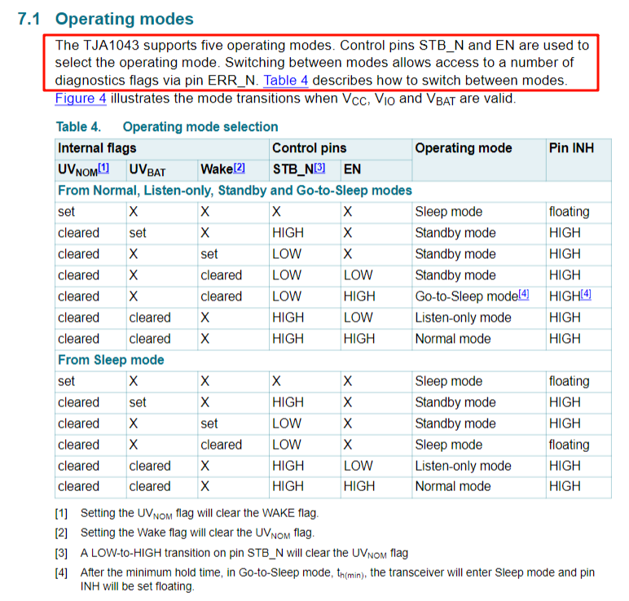

EN 引脚 和STB_N引脚控制mode ERR_N引脚能够读出一些诊断flag

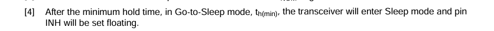
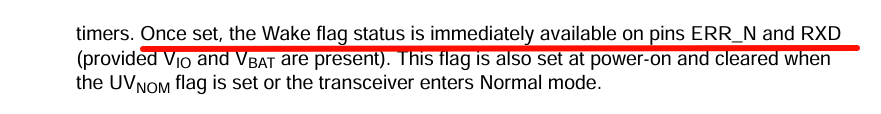
INH引脚特性 在sleep mode下 INH引脚为float  在实际的设计上可以加一个下拉电阻 则为LOW

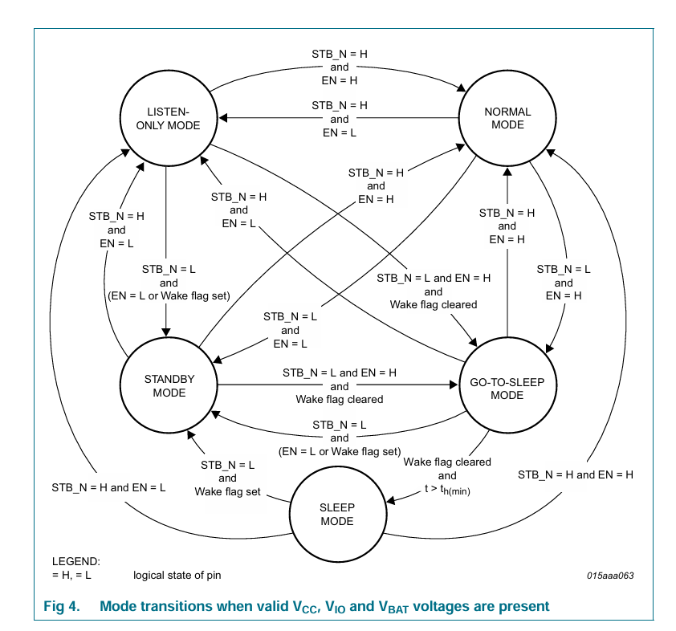

图中可以看到 sleep　ｍｏｄｅ　只能跳转到ｓｔａｎｄｂｙ　，跳转的条件是ＳＴＢ＿Ｎ为ｌｏｗ　ｗａｋｅｕｐ　ｆｌａｇ　置位　　重点就在于此　　前面我们说到只有ｓｌｅｅｐ　ｍｏｄｅ下ｉｎｈ为低电平　到ｓｔａｎｄｂｙ的时候i为高电平　ｉｎｈ置位后就可以触发电源管理芯片　给ｍｃｕ供电　ｍｃｕ就可以正常运行

但是为什么总线收到报文ｉｎｈ就会置位呢？这里还是没说清楚且听我细细道来

这里ＰＯＬＬｅｄ先画个重点！！！
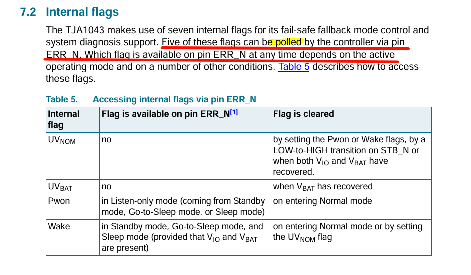
我们可以看到手册上讲有五个ｆｌａｇ可以由ＥＲＲ＿Ｎ引脚报出
其中就要有ｗａｋｅ　，ｗａｋｅ－ｕｐ　ｓｏｕｒｃｅ　两个ｆｌａｇ
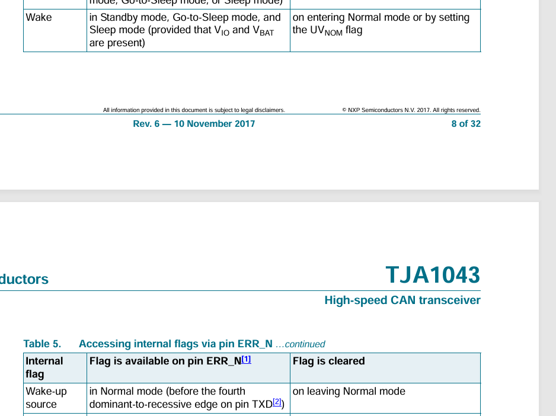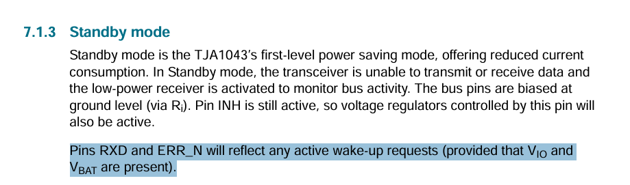
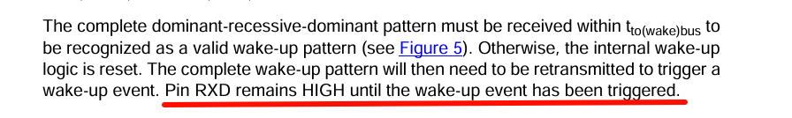

